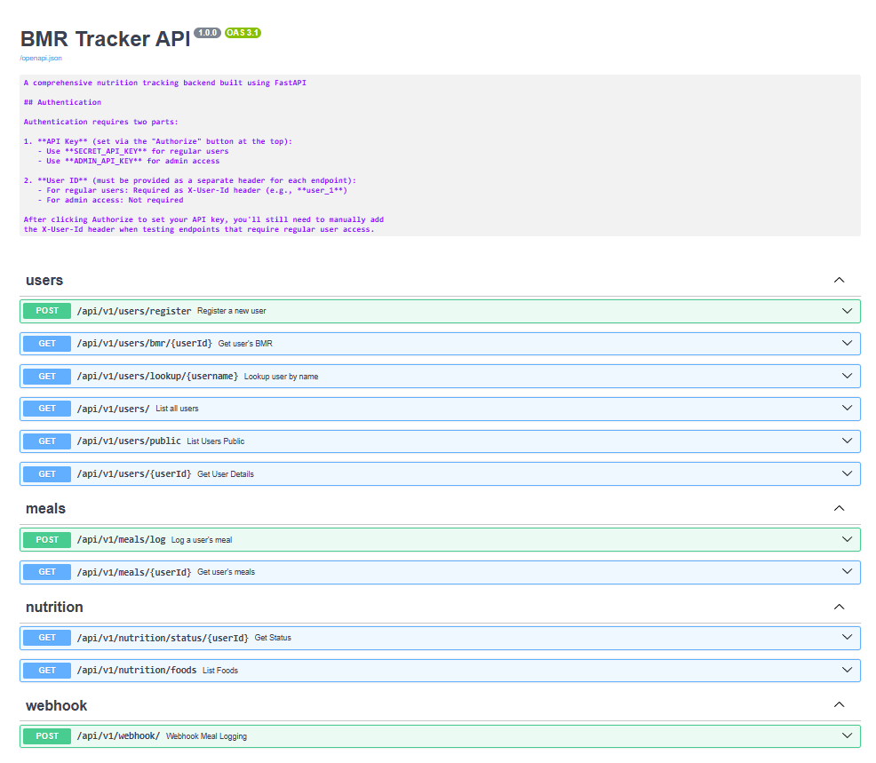
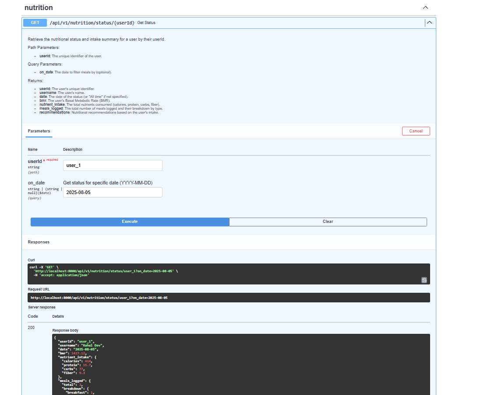
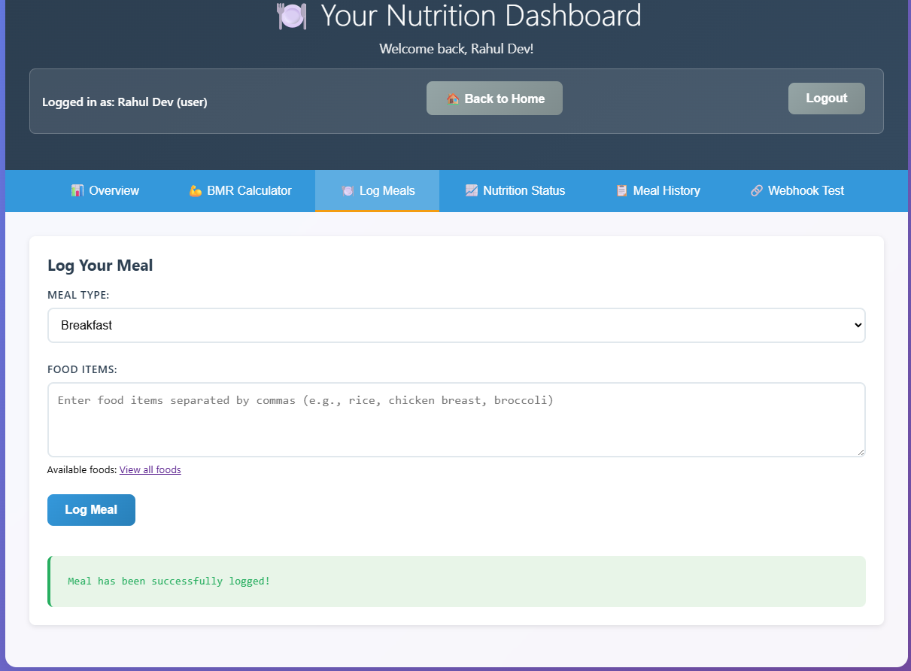
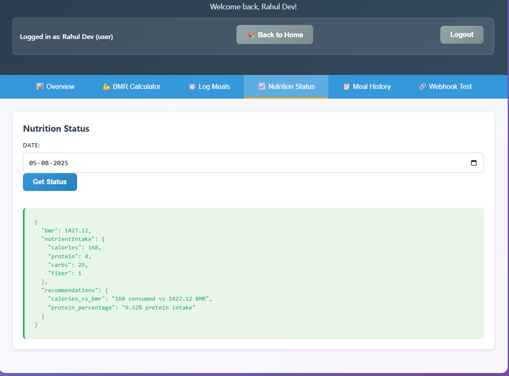
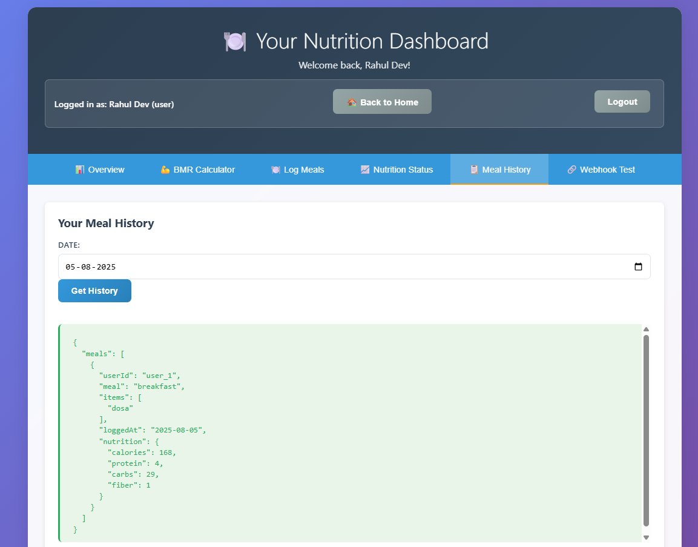
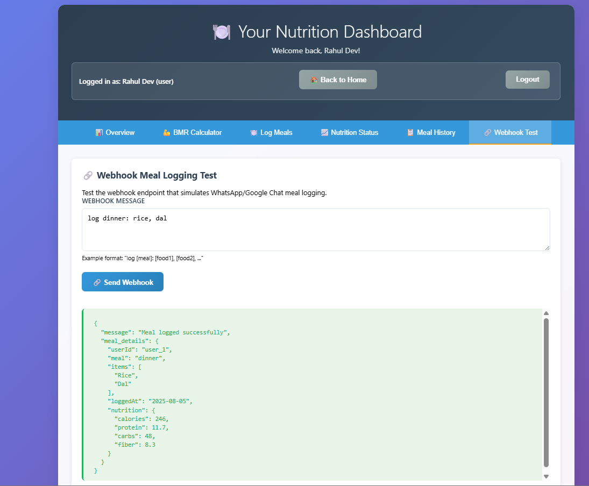

# 🍽️ BMR Tracker - Meal & Nutrition Management System

A comprehensive web application for tracking meals, calculating BMR (Basal Metabolic Rate), and monitoring nutritional intake. Built with FastAPI backend and vanilla JavaScript frontend.

## ✨ Features

- **User Management**: Register users with profile data and BMR calculation
- **Meal Logging**: Log meals with automatic nutrition calculation  
- **Nutrition Tracking**: Monitor calories, protein, carbs, and fiber intake
- **Dashboard**: Personal nutrition dashboard with daily stats
- **Admin Panel**: User management and analytics
- **Webhook Integration**: Meal logging via chat-like interface
- **Food Database**: 30+ Indian foods with complete nutrition data

## 🚀 Quick Start

### Prerequisites
- Python 3.8+
- Modern web browser
- Git

### Installation & Setup

1. **Clone the repository**
```bash
git clone https://github.com/niweshbaraj/meal-metrics.git
cd meal-metrics
```

2. **Environment Setup (Choose one method)**

#### Option A: Using UV (Recommended - Faster)
```bash
# Install uv if you haven't already
pip install uv

# Activate virtual environment (if using uv venv)
uv venv
# On Windows
.venv\Scripts\activate
# On macOS/Linux
source .venv/bin/activate

# Install dependencies
uv pip install -r requirements.txt
```

#### Option B: Using pip
```bash
# Create virtual environment (recommended)
python -m venv .venv

# Activate virtual environment
# On Windows
.venv\Scripts\activate
# On macOS/Linux
source .venv/bin/activate

# Install dependencies
pip install -r requirements.txt
```

3. **Start the backend server**
```bash
# Using uvicorn directly
uvicorn app.main:app --reload

# Or if using the main.py in root
python main.py
```

4. **Access the application**
- **Frontend**: http://127.0.0.1:8000/frontend/index.html (or open `frontend/index.html` in your browser)
- **API Documentation**: http://127.0.0.1:8000/docs
- **ReDoc Documentation**: http://127.0.0.1:8000/redoc
- **API Base URL**: http://127.0.0.1:8000/api/v1

## 📁 Project Structure

```
meal-metrics/
├── api/                    # FastAPI Backend
│   ├── main.py            # Main application entry
│   ├── routers/           # API route handlers
│   ├── core/              # Authentication & config
│   ├── db/                # Data models & food database
│   └── schemas/           # Pydantic models
├── frontend/              # Vanilla JS Frontend
│   ├── index.html         # Main landing page
│   ├── pages/             # Dashboard & admin pages
│   ├── js/                # JavaScript modules
│   └── css/               # Stylesheets
├── requirements.txt       # Python dependencies
└── README.md             # This file
```

## 📸 Application Screenshots

### Backend API Documentation

**Interactive API Documentation (`/docs`)**


**Nutrition Status Endpoint Response**


### Frontend User Interface

**User Registration Page**


**Meal Logging Interface**


**Nutrition Status Dashboard**


**Meal History View**


**Webhook Testing Interface**


## 🔐 Authentication

Headers required for API calls:
```bash
user-id: your_user_id
```

## 🍽️ Available Foods

**Grains & Rice:** Jeera Rice, Plain Rice, Basmati Rice, Brown Rice, Roti, Chapati, Naan, Paratha

**Proteins:** Various Dals (Toor, Moong, Chana), Chicken Curry, Fish Curry, Paneer, Egg

**Vegetables:** Cucumber, Tomato, Onion, Potato, Carrot, Spinach

**Fruits:** Apple, Banana, Orange

**Snacks:** Samosa, Biscuit

## 🧮 BMR Calculation

Uses the **Mifflin-St Jeor Equation**:
- **Men**: BMR = 88.362 + (13.397 × weight) + (4.799 × height) - (5.677 × age)
- **Women**: BMR = 447.593 + (9.247 × weight) + (3.098 × height) - (4.330 × age)

## � Usage Examples

### 1. Register a User
```bash
curl -X POST "http://127.0.0.1:8000/api/v1/users/register" \
  -H "Content-Type: application/json" \
  -d '{
    "name": "John Doe",
    "age": 25,
    "weight": 70.5,
    "height": 175.0,
    "gender": "male",
    "goal": "maintain"
  }'
```

### 2. Log a Meal
```bash
curl -X POST "http://127.0.0.1:8000/api/v1/meals/log" \
  -H "X-API-Key: SECRET_API_KEY" \
  -H "Content-Type: application/json" \
  -d '{
    "userId": "user_1",
    "meal": "lunch", 
    "items": ["Jeera Rice", "Dal", "Cucumber"]
  }'
```

### 3. Webhook Meal Logging
```bash
curl -X POST "http://127.0.0.1:8000/api/v1/webhook" \
  -H "X-API-Key: SECRET_API_KEY" \
  -H "user-id: user_1" \
  -H "Content-Type: application/json" \
  -d '{"message": "log lunch: Jeera Rice, Dal, Cucumber"}'
```

## 🚀 Deployment

### Local Development
```bash
uvicorn api.main:app --reload --host 0.0.0.0 --port 8000
```

### Production (Render.com)
The project includes `render.yaml` for easy deployment on Render.com

## 🛠️ Development

### API Testing
- Interactive docs: http://127.0.0.1:8000/docs
- ReDoc: http://127.0.0.1:8000/redoc

### Code Quality
```bash
pip install black isort flake8
black .
isort .
flake8 .
```

## 📄 License

MIT License - see LICENSE file for details.
