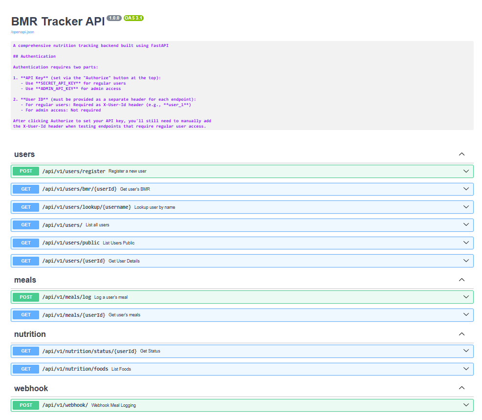
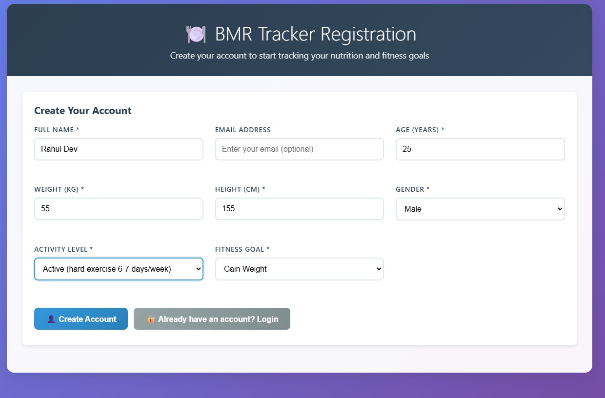
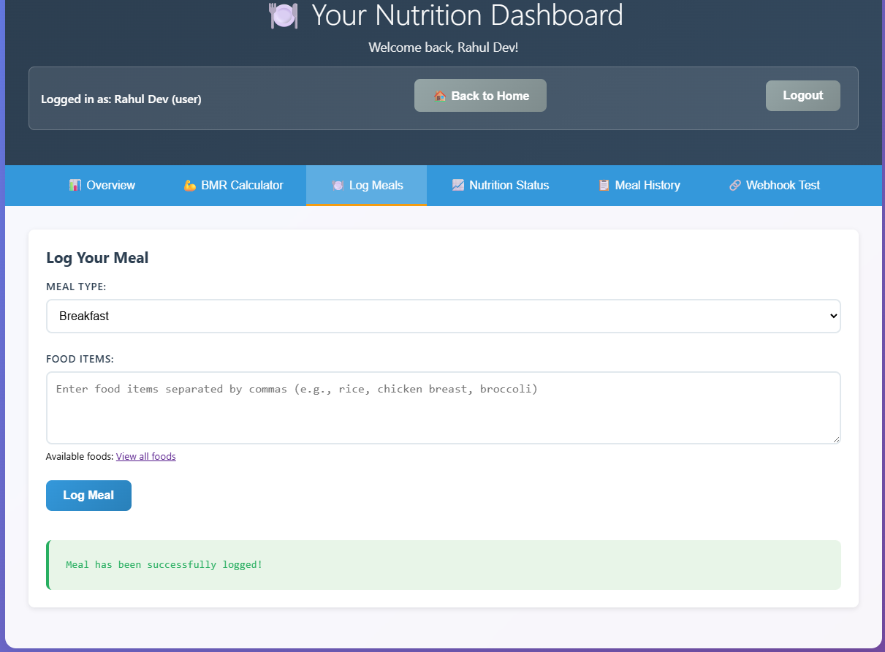
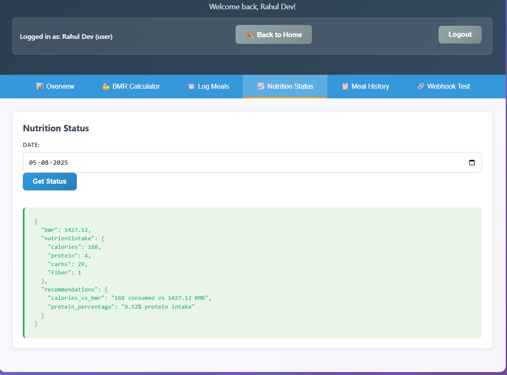
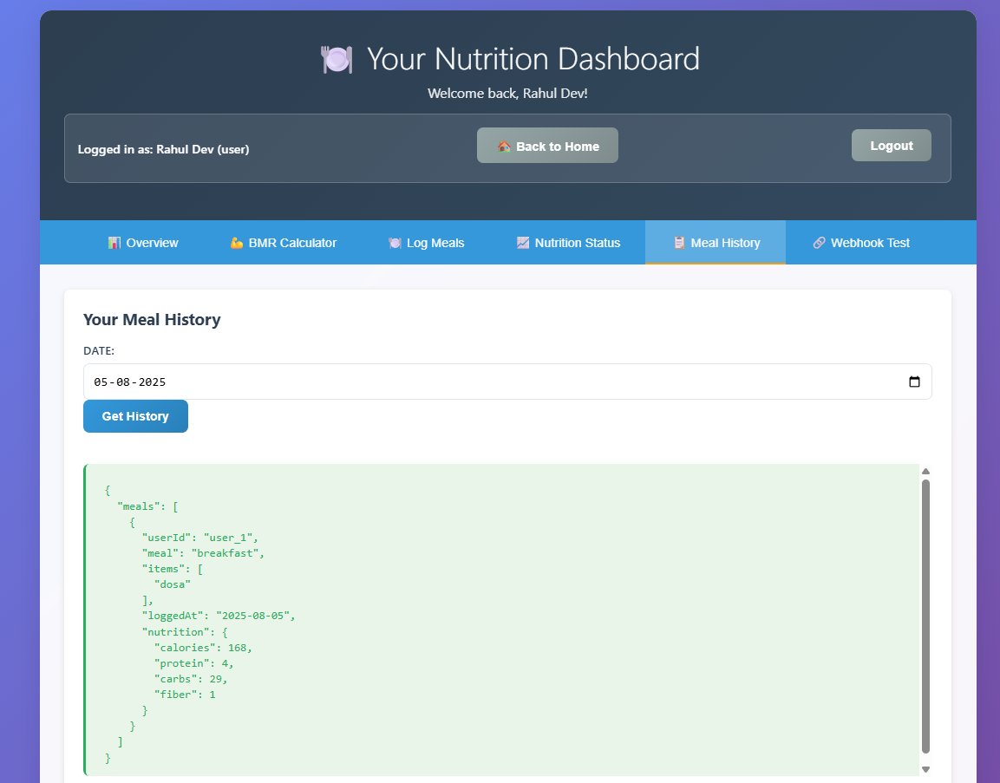
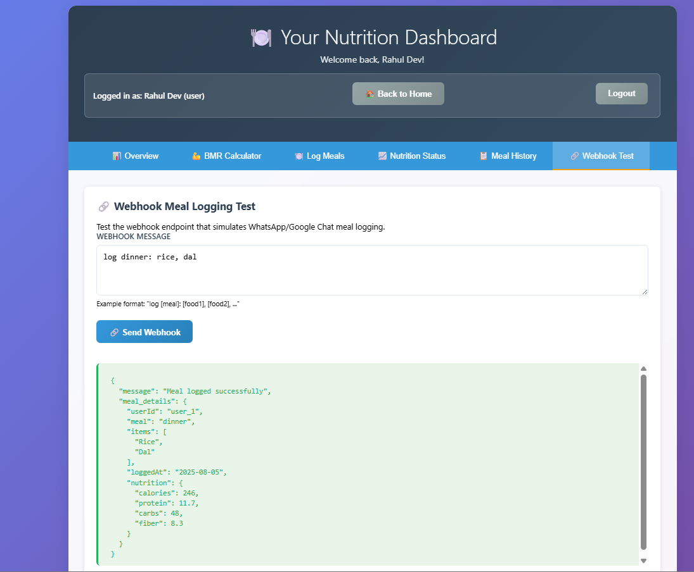
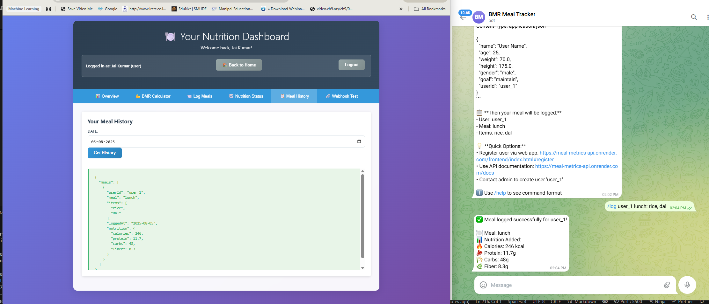

# 🍽️ BMR Tracker - Meal & Nutrition Management System

A comprehensive nutrition tracking system with BMR calculation, meal logging, and multiple integration options including Telegram bot. Built with FastAPI backend and vanilla JavaScript frontend.

## 🌐 Live Demo

🚀 **Try the app now:** [https://meal-metrics-api.onrender.com](https://meal-metrics-api.onrender.com)

- **🎯 Frontend App**: [Launch Application](https://meal-metrics-api.onrender.com/frontend/index.html#register)
- **📖 API Documentation**: [Interactive API Docs](https://meal-metrics-api.onrender.com/docs)

## ✨ Key Features

- **User Management**: Register users with BMR calculation (Mifflin-St Jeor equation)
- **Meal Logging**: Log meals with automatic nutrition calculation  
- **Nutrition Tracking**: Monitor calories, protein, carbs, and fiber intake
- **Dashboard**: Personal nutrition dashboard with daily stats
- **Admin Panel**: User management and analytics
- **Webhook Integration**: Chat-like meal logging interface
- **Telegram Bot**: Log meals directly from Telegram
- **Food Database**: 30+ Indian foods with complete nutrition data

## 🔌 API Endpoints

### User Management
- `POST /api/v1/users/register` - Register new user with BMR calculation
- `GET /api/v1/users/{user_id}` - Get user profile and BMR data
- `PUT /api/v1/users/{user_id}` - Update user profile (recalculates BMR)
- `DELETE /api/v1/users/{user_id}` - Delete user account
- `GET /api/v1/users/` - List all users (admin only)

### Meal Logging
- `POST /api/v1/meals/log` - Log a meal with food items
- `GET /api/v1/meals/{user_id}` - Get user's meal history
- `GET /api/v1/meals/{user_id}/today` - Get today's meals and nutrition summary
- `DELETE /api/v1/meals/{meal_id}` - Delete a meal entry

### Nutrition & Food Database
- `GET /api/v1/nutrition/foods` - Get complete food database with nutrition values
- `GET /api/v1/nutrition/status/{user_id}` - Get user's nutrition status vs BMR
- `POST /api/v1/nutrition/calculate` - Calculate nutrition for food items

### Integration Endpoints
- `POST /api/v1/webhook` - Webhook for external integrations (chat-like commands)
- `POST /api/v1/telegram-bot/webhook` - Telegram bot webhook endpoint

### Admin & Analytics
- `GET /api/v1/admin/stats` - System statistics and user analytics
- `GET /api/v1/admin/users` - User management dashboard data

## 🚀 Quick Setup

### Prerequisites
- Python 3.8+
- Git

### Local Development

1. **Clone and setup**
```bash
git clone https://github.com/niweshbaraj/meal-metrics.git
cd meal-metrics

# Using UV (recommended)
uv venv && .venv\Scripts\activate
uv pip install -r requirements.txt

# Or using pip
python -m venv .venv && .venv\Scripts\activate
pip install -r requirements.txt
```

2. **Start the server**
```bash
uvicorn api.main:app --reload
```

3. **Access the application**
- Frontend: http://127.0.0.1:8000/frontend/index.html
- API Docs: http://127.0.0.1:8000/docs

## 📁 Project Structure

```
meal-metrics/
├── api/                  # FastAPI backend
│   ├── main.py          # Application entry point
│   ├── routers/         # API endpoints
│   ├── core/            # Authentication & config
│   └── db/              # Data models & food database
├── frontend/            # Vanilla JavaScript frontend
├── screenshots/         # Application screenshots
├── pyproject.toml      # Dependencies (includes httpx)
└── render.yaml         # Deployment configuration
```

## 📸 Screenshots

**API Documentation**


**User Registration**


**Meal Logging Interface**


**Nutrition Dashboard**


**Meal History**


**Webhook Integration**


**Telegram Bot Webhook Integration**


## 🤖 Telegram Bot Setup

### 1. Create Bot
1. Message `@BotFather` on Telegram
2. Send `/newbot` and follow instructions
3. Copy your bot token

### 2. Deploy & Configure
1. Push your code to GitHub
2. Deploy to Render (using blueprint or manual setup)
3. In Render dashboard, add environment variable:
   ```
   TELEGRAM_BOT_TOKEN=your_bot_token_here
   ```
4. After deployment, set webhook (replace {YOUR_BOT_TOKEN} and your-app-name):
   ```bash
   curl -X POST "https://api.telegram.org/bot{YOUR_BOT_TOKEN}/setWebhook" \
     -H "Content-Type: application/json" \
     -d '{"url": "https://your-app-name.onrender.com/api/v1/telegram-bot/webhook"}'
   ```

### 3. Usage
```
/log user_1 lunch: rice, dal, vegetables
/help
```

*Note: Bot requires pre-registered users for security*

## 🚀 Production Deployment

### One-Click Deploy (Render)
1. Fork this repository
2. Go to [Render Dashboard](https://dashboard.render.com/)
3. Click "New +" → "Blueprint"
4. Connect your forked repository
5. Click "Apply" to deploy

The `render.yaml` file handles all deployment configuration automatically.

### Manual Deploy
1. Create new Web Service on Render
2. Connect your repository
3. Set build command: `pip install -r requirements.txt`
4. Set start command: `uvicorn api.main:app --host 0.0.0.0 --port $PORT`

## 🔐 Authentication

API endpoints require headers:
```bash
X-API-Key: SECRET_API_KEY    # For meal logging and admin endpoints
user-id: your_user_id        # For user-specific operations
```

## 📊 Example API Usage

### Register User
```bash
curl -X POST "https://your-app.onrender.com/api/v1/users/register" \
  -H "Content-Type: application/json" \
  -d '{
    "name": "John Doe",
    "age": 25,
    "weight": 70.5,
    "height": 175.0,
    "gender": "male",
    "goal": "maintain"
  }'
```

### Log Meal
```bash
curl -X POST "https://your-app.onrender.com/api/v1/meals/log" \
  -H "X-API-Key: SECRET_API_KEY" \
  -H "Content-Type: application/json" \
  -d '{
    "userId": "user_1",
    "meal": "lunch", 
    "items": ["rice", "dal", "vegetables"]
  }'
```

### Webhook Integration
```bash
curl -X POST "https://your-app.onrender.com/api/v1/webhook" \
  -H "X-API-Key: SECRET_API_KEY" \
  -H "user-id: user_1" \
  -H "Content-Type: application/json" \
  -d '{"message": "log lunch: rice, dal, vegetables"}'
```

## 🍽️ Food Database

**Grains:** Rice varieties, Roti, Chapati, Naan, Paratha  
**Proteins:** Various Dals, Chicken Curry, Fish Curry, Paneer, Egg  
**Vegetables:** Cucumber, Tomato, Onion, Potato, Carrot, Spinach  
**Fruits:** Apple, Banana, Orange  
**Snacks:** Samosa, Biscuit  

*Complete nutrition data available via `/api/v1/nutrition/foods` endpoint*

## 📄 License

MIT License - see LICENSE file for details.
